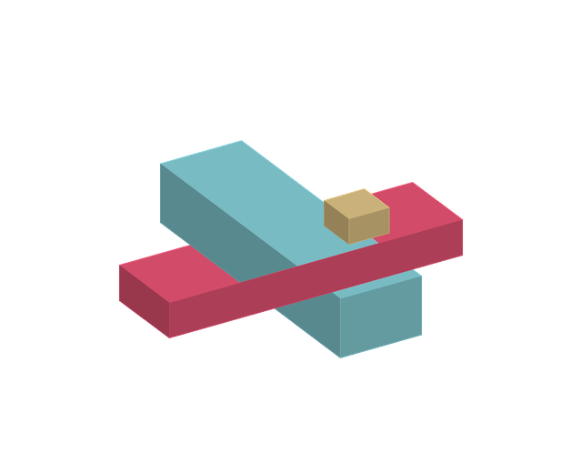
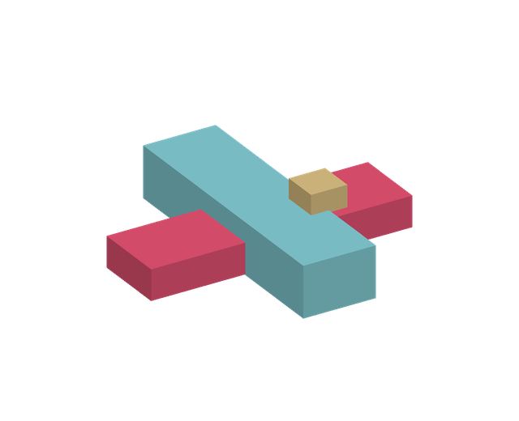

# Build Your Next Advantage — picture and sound correction

The first English cut had real rendering and editorial synchronization defects. Its playback and freeze checks did not catch them.

## What changed
- **Occlusion:** averaging each face's depth drew some hidden surfaces on top of foreground objects. The revised rasterizer interpolates depth per pixel. An independent ray/box test checks 519 interior pixels.
- **Framing:** the fixed local rendering canvas cropped floating memory stacks. Dynamic geometry bounds and revised camera framing retain complete objects. All 600 mechanism-scene frames are checked against the safe picture region.
- **Contact:** compute dies and HBM stacks previously stopped above the interposer. All eight now touch it on their explicit landing frames. Their descent has a clear stop at contact.
- **Sound:** the previous music accented sections but did not follow individual actions. The new score and Foley share the same frame-based timing source as the animation: title arrivals, moving parts, physical contacts, comparison completion and roadmap reveals.
- **Delivery:** the renderer now rejects concurrent writers and publishes its output only after encoding completes. The site uses a new MP4 filename to avoid a stale cached film.

## Reproducible evidence
- [Independent depth and full-sequence geometry checks](geometry-verification.json)
- [Encoded AAC timing and contact cue checks](sync-verification.json)
- [Full decode, picture freeze and audio level checks](verification.json)
- [Shared picture and sound event schedule](sync-events.json)

Depth regression, before:

Depth regression, corrected:

Final encoded mechanism shots were sampled at 8 fps for visual review, separately from the numerical checks. Audio timing checks measure whether encoded AAC preserves the frame-locked master timing; they are not a subjective guarantee of musical quality. There is no voiceover.
